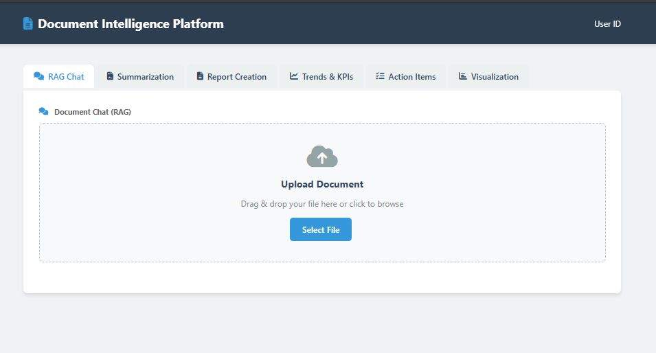
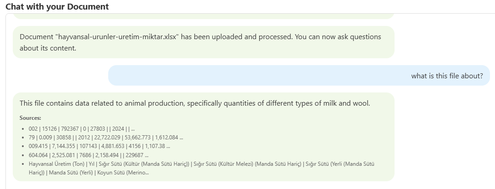
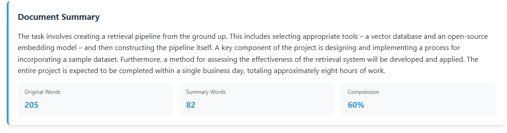
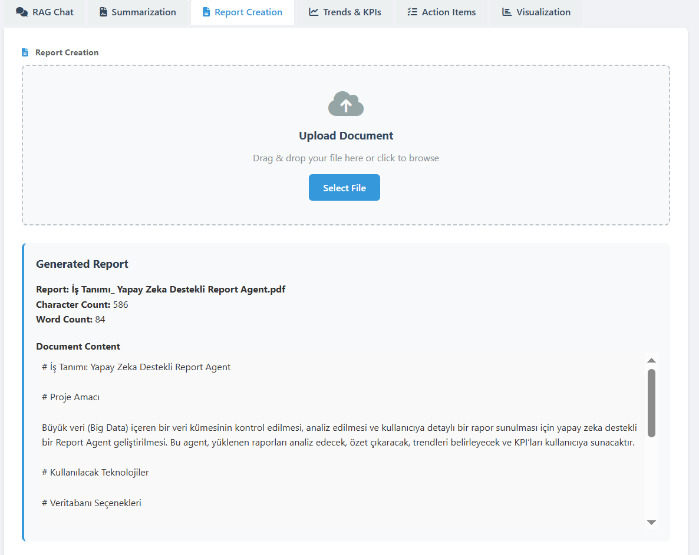
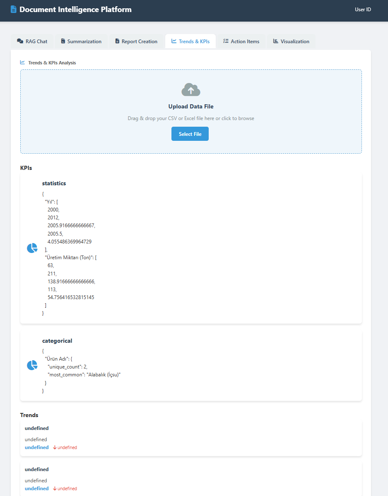
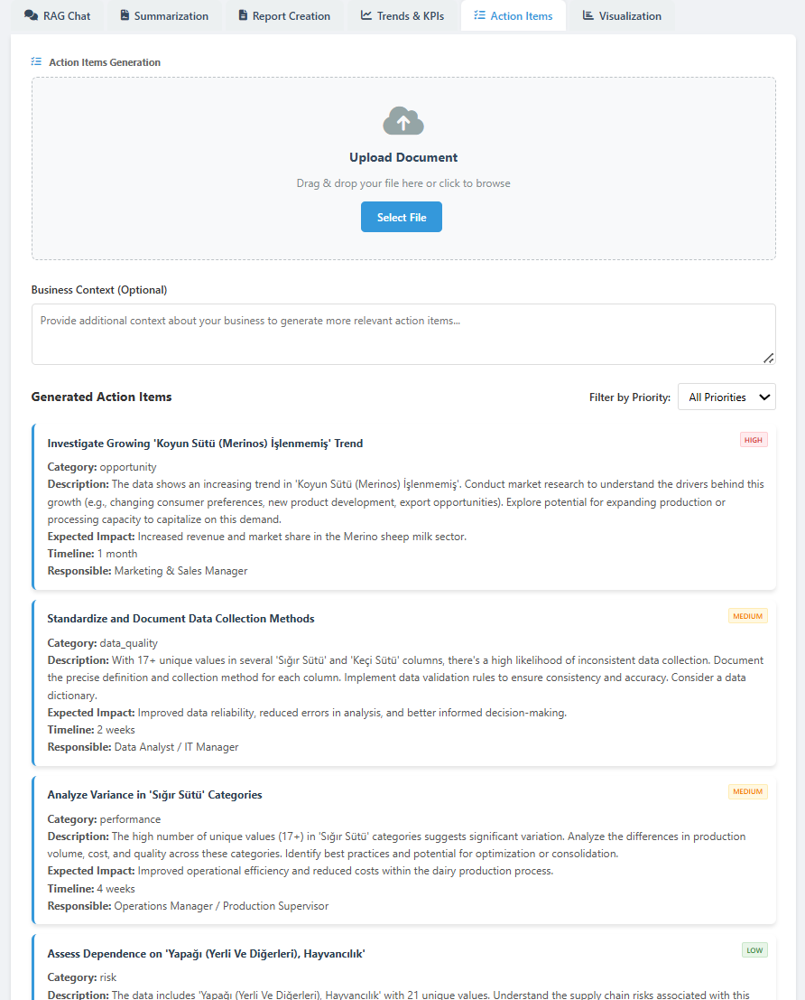
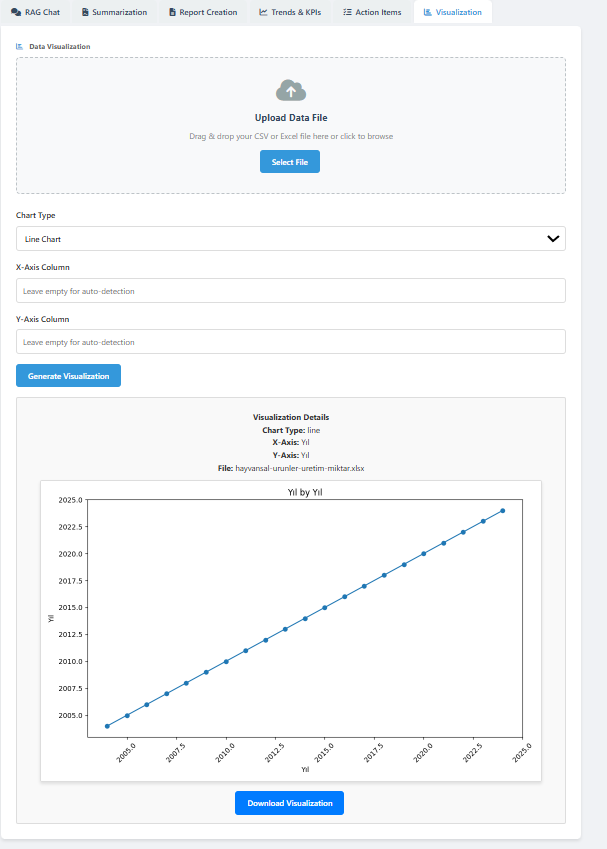

# Dux8-Yapay-Zeka-Destekli-Report-Agent

## Project Overview

This AI-powered Report Agent was developed to fulfill the requirements of processing big data, analyzing reports, and providing detailed insights to users. The system combines modern web technologies with advanced AI capabilities to deliver a complete document intelligence solution.

### Key Features

- **Document Upload & Processing**: Support for PDF, Excel, CSV, TSV files
- **AI-Powered Analysis**: Automatic summarization, trend detection, and KPI extraction
- **RAG (Retrieval Augmented Generation)**: Chat with your documents using natural language
- **Action Items Generation**: Convert insights into actionable business recommendations  
- **Data Visualization**: Interactive charts and graphs
- **Multi-Tab Dashboard**: Organized interface for different functionalities

## Architecture

### Backend (FastAPI)
- **API Layer**: RESTful APIs for all functionalities
- **Services Layer**: Business logic for document processing, data analysis, and AI integration
- **Models Layer**: Data models and database schemas
- **Database**: SQLAlchemy with SQLite for data persistence

### Frontend (HTML/CSS/JavaScript)
- **Multi-tab Interface**: RAG Chat, Summarization, Report Creation, Trends & KPIs, Action Items, Visualization
- **Drag & Drop Upload**: User-friendly file upload experience
- **Interactive Dashboard**: Real-time data visualization and analysis results

### AI/ML Integration
- **LlamaIndex**: For RAG implementation and document querying
- **LlamaParse**: Advanced PDF parsing capabilities
- **Language Models**: Support for both local (Ollama) and cloud-based (OpenAI) models
- **Polars**: High-performance data processing
- **Matplotlib**: Chart generation and visualization

## Project Structure

```
src/
├── backend/
│   └── app/
│       ├── main.py                 # FastAPI application entry point
│       ├── api/                    # API endpoints
│       │   ├── action.py          # Action items generation
│       │   ├── data.py            # Data processing and visualization
│       │   ├── llamaparse.py      # PDF parsing with LlamaParse
│       │   ├── rag.py             # RAG functionality
│       │   ├── structured_parse.py # Structured data parsing
│       │   └── summary.py         # Document summarization
│       ├── core/
│       │   └── database.py        # Database configuration
│       ├── crud/
│       │   └── crud.py            # Database operations
│       ├── models/                # Pydantic models and database schemas
│       └── services/              # Business logic
│           ├── action_service.py  # Action items service
│           ├── data_processor.py  # Data analysis service
│           ├── file_service.py    # File handling service
│           ├── rag_service.py     # RAG service
│           └── summary_service.py # Summarization service
├── frontend/
│   ├── index.html                 # Main HTML file
│   ├── script.js                  # JavaScript functionality
│   └── style.css                  # Styling
└── uploads/                       # File storage
    └── visualizations/            # Generated charts
```

## Quick Start

### Prerequisites
- Python 3.13
- OpenAI API key (for cloud-based AI features)
- LlamaParse API key (for advanced PDF parsing)

### Installation

1. **Clone the repository**
```bash
git clone https://github.com/g-hano/Dux8-Yapay-Zeka-Destekli-Report-Agent.git
cd document-intelligence-platform
```

2. **Install dependencies**
```bash
pip install -r requirements.txt
```

3. **Configure environment variables**
Create a `.env` file in the `src` directory:
```env
OPENAI_API_KEY=your_openai_api_key_here
LLAMAPARSE_API_KEY=your_llamaparse_api_key_here
```

4. **Start the backend server**
```bash
cd src/backend/app
python main.py
```

5. **Open the frontend**
Open `src/frontend/index.html` in your web browser.

---

## 📱 Usage

You can find the demo video [here](https://drive.google.com/drive/folders/17yIaO-gm7EbDhzzbY5nfm-SiSXkeJpzV?usp=drive_link)

*I sped up the video because I was testing with Ollama models and it was slow*

---



### 1. RAG Chat
Upload documents and chat with them using natural language queries. The system will provide accurate answers based on the document content.




---

### 2. Document Summarization  
Generate concise summaries of uploaded documents with configurable length and focus areas.



---

### 3. Report Creation
Automatically generate comprehensive reports from uploaded data files with statistics and insights.



---

### 4. Trends & KPIs Analysis
Extract key performance indicators and identify trends from structured data files (CSV, Excel).



---

### 5. Action Items Generation
Convert analysis results into actionable business recommendations with priority levels and timelines.



---

### 6. Data Visualization
Create interactive charts and graphs from your data with multiple visualization types.



---

## 🛠️ Technology Stack

### Backend
- **FastAPI**: Modern, fast web framework for building APIs
- **SQLAlchemy**: SQL toolkit and Object-Relational Mapping library
- **LlamaIndex**: Framework for building LLM applications
- **LlamaParse**: Advanced document parsing service
- **Polars**: Lightning-fast DataFrame library
- **Matplotlib**: Plotting library for visualizations

### Frontend  
- **HTML5/CSS3**: Modern web standards
- **Vanilla JavaScript**: Pure JavaScript for interactions
- **Responsive Design**: Mobile-friendly interface

### AI/ML
- **OpenAI Models**: For text generation and analysis
- **Ollama**: Local language model support
- **RAG (Retrieval Augmented Generation)**: Document-aware AI responses
- **Vector Embeddings**: For semantic search and similarity

## 📊 Features Breakdown

### ✅ Backend Development (Data Analysis Services)
- ✅ APIs capable of handling big data processing
- ✅ Multi-format report upload support (Excel, CSV, PDF, etc.)
- ✅ AI/ML-powered data analysis and summarization
- ✅ KPI calculation and trend analysis services

### ✅ Frontend Development (User Interface)
- ✅ Intuitive report upload interface
- ✅ Summary reports, KPI and trend visualizations
- ✅ User-friendly dashboard with multiple tabs
- ✅ Filtering and comparison capabilities

### ✅ AI Integration
- ✅ Automated summary, trend and KPI extraction from reports
- ✅ Natural language support for document querying
- ✅ Conversion of analysis results into actionable items


**Developed by**: Cihan Yalçın  
**Date**: September 25, 2025
